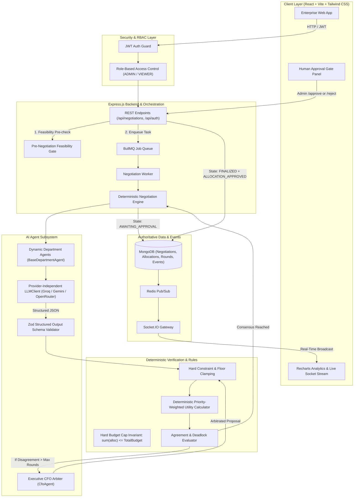

# Negotiating Budget Agents

> **Enterprise Autonomous Multi-Agent AI Budget Allocation Platform with Deterministic Backend Validation and Human-in-the-Loop Governance.**

[](https://github.com/Swatipal06/AIBudgetNego/actions)
[](https://opensource.org/licenses/MIT)
[](https://nodejs.org)
[](https://www.docker.com/)

---

## 1. Executive Summary & Problem Objective

In enterprise organizations, budget allocation across departments (e.g., Engineering, Marketing, Sales, Operations) is inherently a multi-party negotiation under strict financial constraints. Departments submit competing budget requests that collectively exceed the total corporate budget cap:

$$\sum_{i} \text{RequestedBudget}_i > \text{TotalCompanyBudget}$$

### Example Scenario
- **Total Company Budget Ceiling**: ₹10,00,000
- **Engineering Request**: ₹5,00,000 (Min Acceptable Floor: ₹4,00,000)
- **Marketing Request**: ₹4,00,000 (Min Acceptable Floor: ₹2,50,000)
- **Sales Request**: ₹3,00,000 (Min Acceptable Floor: ₹2,00,000)
- **Total Initial Demand**: ₹12,00,000 (₹2,00,000 Deficit)

**Negotiating Budget Agents** models each department as an autonomous AI agent representing its department's priorities, negotiation strategy, hard operational constraints, and soft preferences. Agents propose, counteroffer, and make strategic concessions in real time to reach a feasible consensus within the budget cap. If agents reach a deadlock, an executive **CFO Arbiter** resolves the impasse.

> [!IMPORTANT]
> **Core Architectural Invariant:**
> *"LLMs propose. The deterministic backend validates and coordinates. A human administrator confirms."*
> The AI never has direct mutation authority over authoritative financial state. No allocation is finalized until an authenticated Administrator executes the human approval gate.

---

## 2. System Architecture



---

## 3. Technology Stack

| Domain | Technology | Purpose |
| :--- | :--- | :--- |
| **Frontend** | React 18, Vite 5, Tailwind CSS | High-performance enterprise dark UI with glassmorphism |
| **Data Viz** | Recharts, Lucide Icons | Real-time comparative budget breakdown and allocation charts |
| **Backend** | Node.js, Express.js | Robust modular REST API and state management |
| **Database** | MongoDB & Mongoose | Document persistence for users, negotiations, rounds, allocations, and events |
| **Async Processing** | BullMQ & Redis / Upstash | Distributed queue processing with graceful fallback |
| **Real-time** | Socket.IO & Redis Pub/Sub | Sub-second event streaming to live timeline rooms |
| **AI Integration** | Provider-independent `LLMClient` | Groq (Llama-3.3-70B), Google Gemini (1.5-Flash), OpenRouter |
| **Structured Output** | Zod Schema Validation | Strict runtime validation and auto-repair of LLM JSON responses |
| **Authentication** | JWT & Bcrypt.js | Cryptographic token auth with strict RBAC (`ADMIN` vs `VIEWER`) |
| **Logging** | Winston Structured Logger | JSON structured logs with request and negotiation tracing |
| **Testing** | Jest, Supertest, MongoMemoryServer | 20+ automated unit and integration tests |
| **DevOps** | Docker, Docker Compose, GitHub Actions | Multi-stage container builds and CI test pipeline |

---

## 4. Key Architectural Innovations

### 1. Zero LLM Financial Authority
LLM models are inherently probabilistic. Allowing an LLM to mutate financial records directly introduces severe enterprise hallucination risk. In this architecture:
- Agents return proposed values through Zod schemas.
- The backend deterministically clamps any proposal below the department's `minAcceptableBudget`.
- The engine guarantees $\sum \text{Allocations} \le \text{CompanyBudget}$ at every tick.

### 2. Deterministic Feasibility Pre-Check
Before invoking any LLM or starting a worker, the engine computes:
$$\sum_{i} \text{MinAcceptableBudget}_i \le \text{TotalCompanyBudget}$$
If the minimum non-negotiable requirements exceed the total budget, the negotiation is halted deterministically with a clear mathematical deficit message.

### 3. Deterministic Utility Formulation
Authoritative utility scores ($U_i \in [0, 100]$) are calculated purely on the backend:
- If $\text{Allocated} < B_{\min}$: $U_i = 0$ (Hard constraint violated)
- If $\text{Allocated} \ge B_{\text{req}}$: $U_i = 100$
- If $B_{\min} \le \text{Allocated} < B_{\text{req}}$:
  $$U_i = 50 + 50 \times \left( \frac{\text{Allocated} - B_{\min}}{B_{\text{req}} - B_{\min}} \right)$$

Global corporate utility is computed as a weighted average using strategic priority weights:
$$\text{GlobalUtility} = \frac{\sum w_i \cdot U_i}{\sum w_i} \quad \text{where } w_{\text{HIGH}}=1.3, \, w_{\text{MEDIUM}}=1.0, \, w_{\text{LOW}}=0.7$$

### 4. Two-Stage Human Approval Gate
When department agents reach consensus (`SETTLED`) or the CFO arbitrates (`DEADLOCK`), the system transitions to `AWAITING_APPROVAL`.
- Only an authenticated `ADMIN` can approve via `POST /api/negotiations/:id/approve` or reject via `POST /api/negotiations/:id/reject`.
- A `VIEWER` attempting approval receives an immediate `HTTP 403 Forbidden`.
- Approval updates `approvedBy`, `approvedAt`, `approvalNote`, transitions the state to `FINALIZED`, and creates an immutable audit record.

---

## 5. Complete Audit Trail

Every state mutation in the lifecycle is logged in the `NegotiationEvent` model and viewable via the **Audit Trail Modal**:

```text
10:01:02 [ADMIN] NEGOTIATION_CREATED: Created with budget ₹10,00,000 across 3 departments.
10:01:15 [SYSTEM] NEGOTIATION_STARTED: Multi-agent negotiation initiated (Max Rounds: 5).
10:01:16 [SYSTEM] ROUND_STARTED: Round 1 of 5 initiated.
10:01:17 [DEPARTMENT_AGENT] PROPOSAL_CREATED: Engineering proposed ₹5,00,000 (Utility: 100%).
10:01:18 [DEPARTMENT_AGENT] PROPOSAL_CREATED: Marketing proposed ₹4,00,000 (Utility: 100%).
10:01:19 [DEPARTMENT_AGENT] PROPOSAL_CREATED: Sales proposed ₹3,00,000 (Utility: 100%).
10:01:20 [SYSTEM] ROUND_COMPLETED: Budget conflict detected. Total demand: ₹12,00,000 vs Budget: ₹10,00,000.
10:01:21 [SYSTEM] ROUND_STARTED: Round 2 of 5 initiated.
10:01:22 [DEPARTMENT_AGENT] CONCESSION: Engineering conceded ₹40,000 and proposed ₹4,60,000.
10:01:23 [DEPARTMENT_AGENT] CONCESSION: Marketing conceded ₹50,000 and proposed ₹3,50,000.
10:01:24 [DEPARTMENT_AGENT] CONCESSION: Sales conceded ₹30,000 and proposed ₹2,70,000.
10:01:25 [SYSTEM] ROUND_COMPLETED: Round 2 completed within constraints. Total: ₹10,80,000.
10:01:26 [SYSTEM] ROUND_STARTED: Round 3 of 5 initiated.
10:01:27 [DEPARTMENT_AGENT] CONCESSION: Engineering conceded ₹30,000 and proposed ₹4,30,000.
10:01:28 [DEPARTMENT_AGENT] CONCESSION: Marketing conceded ₹30,000 and proposed ₹3,20,000.
10:01:29 [DEPARTMENT_AGENT] CONCESSION: Sales conceded ₹20,000 and proposed ₹2,50,000.
10:01:30 [SYSTEM] AGREEMENT_REACHED: Consensus reached in Round 3. Total allocation: ₹10,00,000.
10:01:30 [SYSTEM] AWAITING_APPROVAL: Proposed allocation submitted for administrator review.
10:01:45 [ADMIN] ALLOCATION_APPROVED: Sarah Chen approved allocation. Note: "Approved for Q3 execution."
10:01:45 [SYSTEM] NEGOTIATION_FINALIZED: Negotiation is officially FINALIZED and binding.
```

---

## 6. Local Quickstart Guide

### Prerequisites
- Node.js >= 20.0.0
- MongoDB instance (local or free MongoDB Atlas)
- Redis instance (local or Upstash Redis - optional; graceful fallback active)

### 1. Clone & Configure
```bash
git clone https://github.com/Swatipal06/AIBudgetNego.git
cd AIBudgetNego
cp .env.example .env
```

Edit `.env` with your API keys (optional; simulated heuristic fallback works automatically if keys are omitted):
```env
PORT=8000
MONGODB_URI=mongodb://localhost:27017/budget_agents
REDIS_URL=redis://localhost:6379
JWT_SECRET=enterprise_jwt_secret_key_2026
LLM_PROVIDER=groq
GROQ_API_KEY=your_groq_api_key
CLIENT_URL=http://localhost:5173
```

### 2. Install Dependencies
```bash
# Install root, backend, and frontend packages
npm run install:all
```

### 3. Seed Demo Data
```bash
npm run seed
```

**Default Demo Credentials:**
- **ADMIN**: `admin@enterprise.ai` / `Admin@12345` (Full access & approval gate)
- **VIEWER**: `viewer@enterprise.ai` / `Viewer@12345` (Read-only observation)

### 4. Run Development Servers
```bash
npm run dev
```
- Frontend: `http://localhost:5173`
- Backend API: `http://localhost:8000`
- Health Check: `http://localhost:8000/api/health`

---

## 7. Running with Docker

Run the complete multi-container stack (MongoDB, Redis, Backend, Frontend) with a single command:

```bash
docker-compose up --build
```

Access the application at `http://localhost:5173`.

---

## 8. Automated Testing

Execute the deterministic backend test suite:

```bash
cd server
npm test
```

### Test Coverage Highlights:
1. **Feasibility Validation**: Rejection when $\sum B_{\min} > \text{Budget}$.
2. **Budget Enforcement**: Clamping proposals below $B_{\min}$ or above $B_{\text{req}}$.
3. **Utility Precision**: Mathematical accuracy of priority-weighted utility formulas.
4. **Zod Parsing & Repair**: Validation of structured LLM outputs and schema rejection.
5. **CFO Arbitration**: Deterministic guarantee of minimum allocations during deadlock.
6. **RBAC Security**: Verification that `VIEWER` receives `HTTP 403` on administrative endpoints.
7. **Approval Gate State Machine**: Lifecycle validation (`AWAITING_APPROVAL` $\rightarrow$ `FINALIZED`).

---

## 9. Governance & Product Philosophy

The system strictly adheres to enterprise language guidelines:
- ❌ *"AI discovered the perfect allocation."*
- ❌ *"The AI made the final financial decision."*
- ❌ *"The result is objectively fair."*
- ✅ *"The system reached a feasible allocation that satisfies hard constraints and optimizes participating departments' stated priorities, pending human administrator confirmation."*

---

## 10. License

MIT License. Designed and engineered for production-grade enterprise multi-agent AI orchestration.
